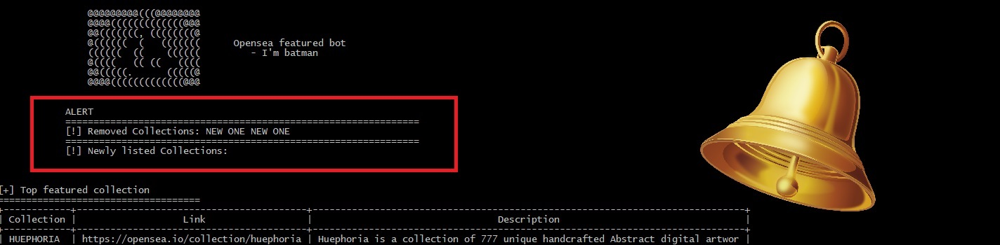

# Welcome to Coin-Tracker (and friends) !

"Friends" because of other tools embeded within such as **opensea-tools** (getting "featured data", YKWIM)

# Requirements
So first make sure you have the following

 - Python (latest version) [Download the latest version here](https://www.python.org/downloads/)
 - Windows 7/8/10/11 (no support for Mac and Linux at the moment)

# Setup

Make sure you are on Windows because this tool is only supported in Windows for now. An update that will support **Mac and Linux** shall be released soon in this directory **/Other Platforms/Mac and Linux**.

## Installing in Windows
- Just **open command prompt in Windows** with  **Windows Key + R** and type "cmd"
or
Press Windows Key and **search for "Command Prompt" or "cmd"**
- Navigate to the folder you wanna clone this repository to like "Downloads" with  
`cd Downloads` 

- Then clone with: 
`git clone https://github.com/ianwright27/coin-tracker.git` 

- Run setup.py:
`cd coin-tracker` 
`python setupy.py` 

	This will install dependencies required. That's all.

# Running coin-tracker
`cd crypto-tools` 
`python crypto-fetch.py` 

# Running opensea-featured-tool
`cd opensea-tools` 
`python get-featured.py` 

