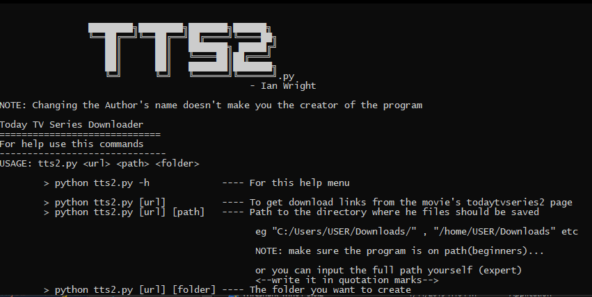

# tts2
A TV Series downloader.

### Setup
```
git clone https://github.com/ianwright27/tts2_TV-Series-Downloader.git
python setup.py
```
After that, 
```
python main.py
```
... and enjoy

# Modules
#### BeautifulSoup
#### Requests


